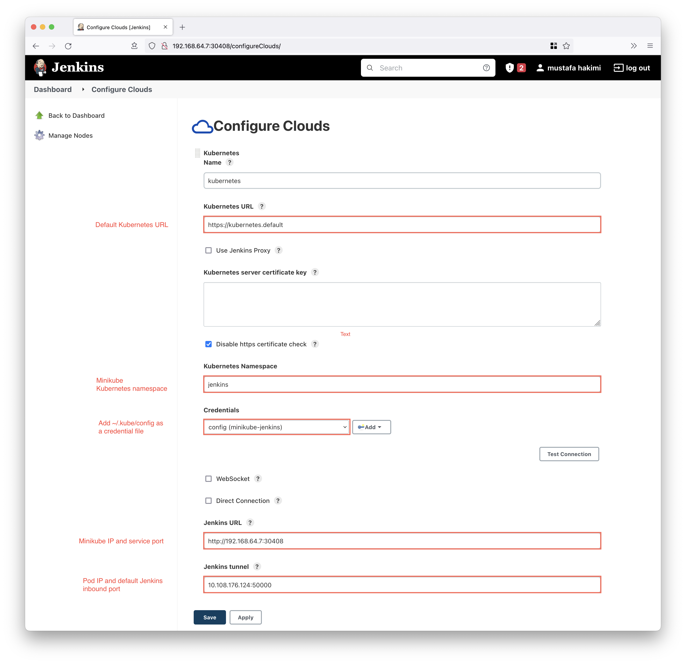
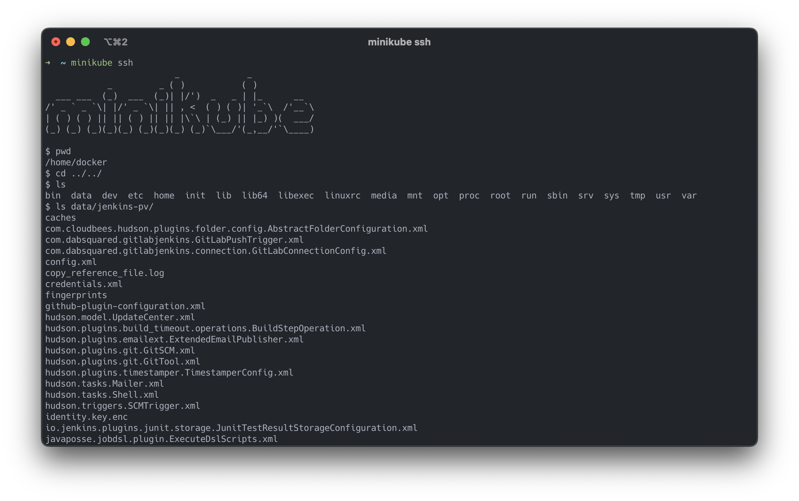

# Jenkins on Kubernetes using Minikube

* [Setup](#setup)
* [Jenkins Configure Cloud](#jenkins-configure-cloud)
  * [Configure the Jenkins Controller](#configure-the-jenkins-controller)
  * [Create a Cloud Configuration on the Jenkins Controller](#create-a-cloud-configuration-on-the-jenkins-controller)
* [Jenkins Data](#jenkins-data)

### Setup

1. Create a minikube profile
```shell
# create
minikube start -p jenkins-minikube

# set as default profile
minikube profile jenkins-minikube
```
> Optionally `minikube start -p minikube-jenkins --memory 8192 --cpus 2`

2. Create a namespace
```shell
kubeclt create namespace jenkins
kubens jenkins
```

3. Deploy Kubernetes manifests
```shell
kubectl apply -f ./kubernetes
```

4. Navigate to jenkins using the minikube IP and service port 
```shell
# minikube ip 
minikube profile list

|------------------|-----------|---------|--------------|------|---------|---------|-------|
|     Profile      | VM Driver | Runtime |      IP      | Port | Version | Status  | Nodes |
|------------------|-----------|---------|--------------|------|---------|---------|-------|
| minikube         | hyperkit  | docker  | 192.168.64.2 | 8443 | v1.23.3 | Running |     1 |
| minikube-jenkins | hyperkit  | docker  | 192.168.64.7 | 8443 | v1.23.3 | Running |     1 |
|------------------|-----------|---------|--------------|------|---------|---------|-------|

# service port 
kubectl get service

NAME      TYPE       CLUSTER-IP       EXTERNAL-IP   PORT(S)                                       AGE
jenkins   NodePort   10.108.176.124   <none>        8080:30408/TCP,50000:30707/TCP,80:30962/TCP   34m

# Navigate to 
http://192.168.64.7:30408
```

### Jenkins Configure Cloud

#### Configure the Jenkins Controller
You'll first need to create a credential set for the Jenkins controller to access the Minikube 
Kubernetes cluster. To do this, perform the following steps: 

1. In the Jenkins UI, click the Credentials link in the left-hand navigation pane 
2. Click the arrow next to (global) in the Stores scoped to Jenkins table (you have to hover next to the link to see the arrow)
3. Click Add Credentials 
4. Under Kind, specify Kubernetes Service Account 
5. Leave the scope set to Global 
6. Click OK.

#### Create a Cloud Configuration on the Jenkins Controller
The next step is to create a cloud configuration for the minikube kubernetes cluster.

1. In the Jenkins UI, go to Manage Jenkins → Manage Nodes and Clouds
2. The following parameters must be set:
   * __Name__: <your choice> - This defaults to kubernetes. 
   * __Kubernetes URL__: `https://kubernetes.default` - This was automatically configured from the service account. 
   * __Kubernetes Namespace__: `jenkins`.
   * __Credentials__: `~/.kube/config` → Select the Kubernetes Service Account credentials you created in the previous step. 
   * __Jenkins URL__: `http://<minikube-ip>:<service-port>` → `http://192.168.64.7:30408`.    
   * __Jenkins tunnel__: `<pod-ip>:<service-port>` → `10.108.176.124:50000` - This is the port that is used to communicate with an agent.



### Jenkins Data

The Jenkins data is stored in the minikube node, and can be accessed with SSH

